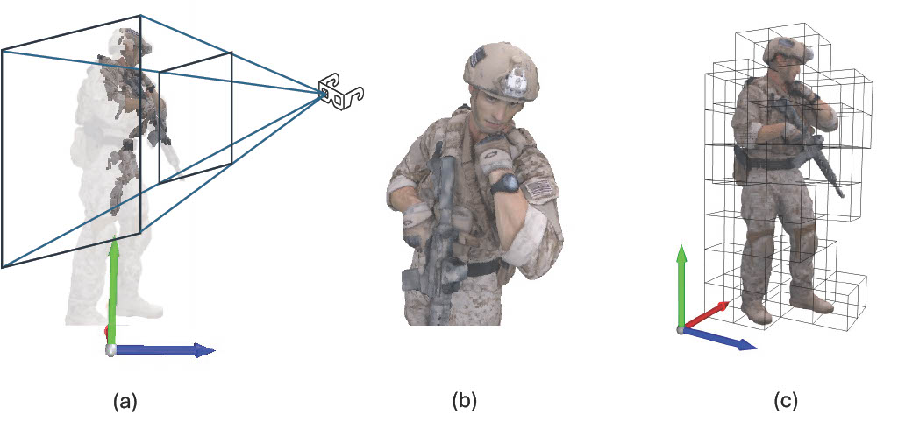
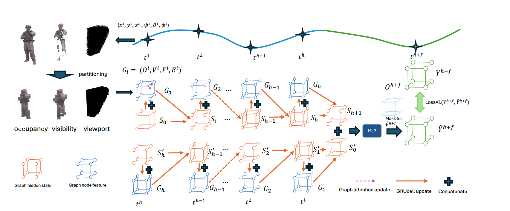
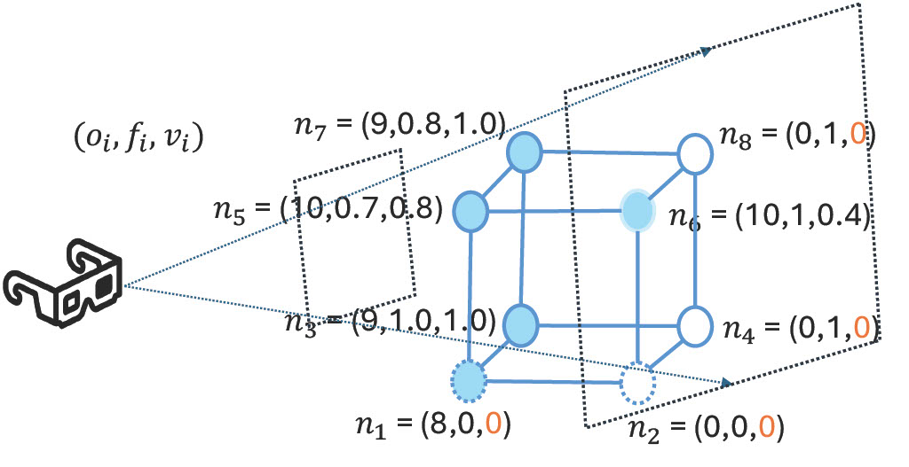
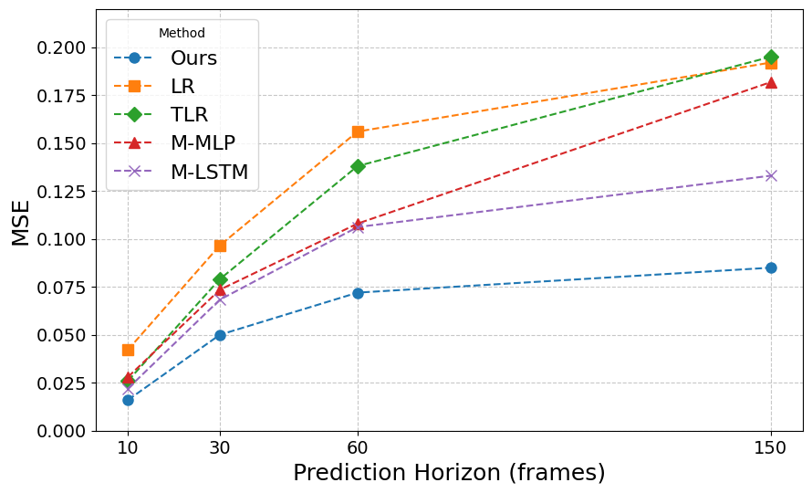
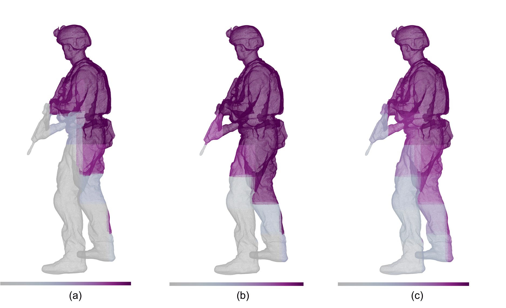

---

## Resources

- 📄 [Download the full paper (PDF)](34934_Spatial_Visibility_and_T.pdf)
- 🎤 [Download the presentation (PDF)](MMSys25_Yong.pdf): Slides presented at MMSys 2025.
- 💻 [View the code on GitHub](https://github.com/chenli1996/CellSight): CellSight code.

---

> 📢 **Featured Publication:** 
> [Spatial Visibility and Temporal Dynamics: Revolutionizing Field of View Prediction in Adaptive Point Cloud Video Streaming](https://dl.acm.org/doi/10.1145/3712676.3714435)

---

## Abstract

Field-of-View (FoV) adaptive streaming significantly reduces the bandwidth required for immersive point cloud video (PCV) by transmitting only visible points within a viewer's FoV. Traditional approaches focus on trajectory-based 6DoF FoV predictions, which often overlook the impact of video content on viewer attention and can be error-prone. We reformulate the PCV FoV prediction problem from the cell visibility perspective, enabling precise transmission decisions at the cell level. Our novel spatial visibility and object-aware graph model (**CellSight**) leverages historical 3D visibility data, spatial perception, occlusion, and neighboring cell correlation to predict future cell visibility. **CellSight** achieves up to 50% reduction in prediction MSE loss compared to state-of-the-art models for 2–5 second horizons, while maintaining real-time performance (>30fps) for point cloud videos with over 1 million points.

---

## Introduction

Immersive AR/VR video streaming, such as 360-degree and point cloud videos, is essential for next-generation applications but demands much higher bandwidth than traditional 2D video. For example, a point cloud video with 300k–1M points requires 1.08–3.6 Gbps. FoV-adaptive streaming transmits only the content within the viewer’s viewport, reducing bandwidth by up to six times.

Accurately predicting the viewer’s future FoV is challenging, requiring a buffer of 2–5 seconds for smooth streaming. Existing methods predict the viewport based on past trajectories, which can lead to errors. We propose a direct approach to predict cell visibility using the viewer’s trajectory, historical visibility, and object spatial features, reducing error amplification and leveraging visibility continuity. Our framework improves long-term prediction accuracy by up to 50% in real-time using actual point cloud video and viewport trajectory datasets.

  
   
  <em>6DoF FoV Demonstration: Content within the pyramid (bounded by far and near planes) is inside the viewport; content outside is not visible. Points inside the viewport may still be occluded. Only highlighted parts in Fig. 1(a) are visible. Dividing the point cloud into 3D cells (Fig. 1(c)), only cells covering visible points need transmission.</em>

---

## Overview of Our Cell Visibility Prediction System

  
   
  <em>The top curve shows the viewer's 6DoF viewport trajectory for a point cloud sequence. The space is partitioned into 3D cells, modeled as a grid-like graph. For each frame, we calculate for each cell: total points ($O^i$), visible points ($V^i$), and percent of cell volume within the viewport ($F^i$). Node features are $G_i=[O^i, F^i, V^i, E^i]$, where $E^i$ includes cell coordinates. A temporal Bidirectional GRU and spatial transformer-based graph model capture patterns in viewer attention and cell visibility. The final output predicts cell visibility or viewport overlap ratios.</em>

---

## Node Features

  
   
  <em>Given the viewer's 6DoF and the point cloud frame in 3D cells, we extract occupancy, viewport, and visibility features ($o_i, f_i, v_i$). Of 8 nodes, 5 are occupied by points. For example, $n_6$ has 10 points but visibility is 0.4 due to occlusion. Nodes without points have visibility set to 0.</em>

---

## Selected Results

| **Method**  | **333ms** | **1000ms** | **2000ms** | **5000ms** |
|-------------|-----------|------------|------------|------------|
| **LR**      | 0.0043    | 0.0102     | 0.0173     | 0.0229     |
| **TLR**     | 0.0028    | 0.0085     | 0.0158     | 0.0223     |
| **M-MLP**   | 0.0036    | 0.0093     | 0.0137     | 0.0232     |
| **M-LSTM**  | **0.0026**| **0.0083** | 0.0126     | 0.0146     |
| **Ours**    | 0.0040    | 0.0100     | **0.0110** | **0.0120** |

*Table 1: MSE of Visibility Prediction by Different Methods at Different Prediction Horizons*

For short-term predictions (<1000 ms), our model maintains consistent cell visibility loss. For long-term predictions, our model reduces MSE loss by up to 20% compared to state-of-the-art methods, crucial for on-demand streaming with 5-second buffers. Our model addresses error amplification in trajectory-based methods and captures temporal and spatial patterns in viewer attention and cell visibility.

  
   
  <em>Viewport prediction loss across different horizons, from 10 frames (333ms) to 150 frames (5000ms).</em>

Our model consistently outperforms all baselines across all horizons, with performance gaps widening at longer horizons.

  
   
  <em>Cell viewport overlap ratio prediction results on the 8i dataset, prediction horizon: 2000ms. Visual comparison of predicted viewport using (a) LSTM model, (b) Ground Truth, and (c) CellSight. Color represents prediction confidence, from dark (low) to bright (high).</em>

We visualize the predicted viewport overlap ratio for a 2-second horizon. The MSE loss for **CellSight** and LSTM are 0.05 and 0.14, respectively. Our prediction is closer to ground truth, especially at viewport edges. LSTM misses parts of the leg, hands, and gun due to over-reliance on trajectory. **CellSight** covers more of the viewport edges and exhibits smoother boundaries, as neural networks filter out high-frequency signals.

---

## Conclusion

**CellSight** is a novel approach for long-term cell visibility prediction in PCV, leveraging spatial and temporal dynamics of content and viewer behavior. It outperforms state-of-the-art methods in accuracy and robustness, especially for long prediction horizons (>2 seconds). By integrating Transformer-based Graph Neural Networks with recurrent neural networks, **CellSight** captures complex interactions between PCV content and viewer interests, as well as correlations among neighboring cells. Unlike trajectory-based FoV prediction methods, our approach yields more accurate and stable predictions for long-term 6DoF FoV prediction.

---

## Acknowledgments

This work was supported in part by the National Science Foundation (NSF) under grant number 2312839.
